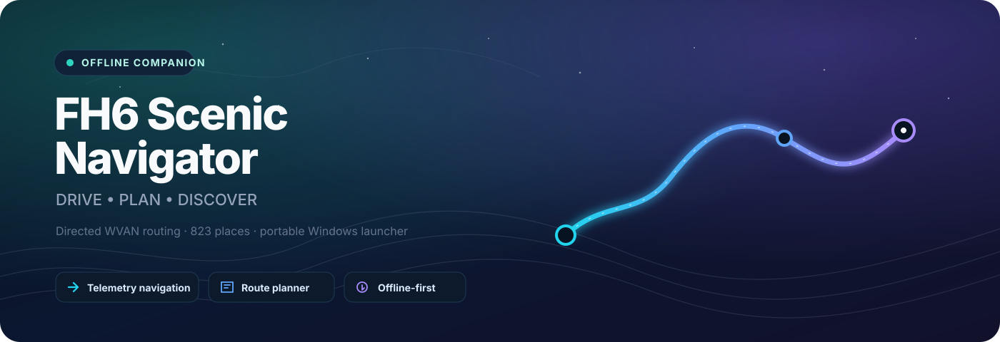

<div align="center">



<br />

[](https://github.com/atikhobaev/fh6-scenic-navigator/actions/workflows/ci.yml)
[](https://github.com/atikhobaev/fh6-scenic-navigator/actions/workflows/release-security.yml)
[](https://github.com/atikhobaev/fh6-scenic-navigator/releases/latest)


**A polished local companion navigator and route planner for FH6.**  
Designed for a second monitor, tablet, or phone while the in-game HUD stays out of the way.

[🇷🇺 Русская техническая документация](README_RU.md) · [📝 Changelog](CHANGELOG.md) · [🛡️ Security](SECURITY.md)

<br />

<a href="https://github.com/atikhobaev/fh6-scenic-navigator/releases/latest/download/FH6_Scenic_Navigator_Windows_x64.exe">
  
</a>

<br />

</div>

> [!NOTE]
> FH6 Scenic Navigator is a personal/private pet project and is not affiliated with Microsoft, Xbox, Playground Games, Turn 10 Studios, or the Forza brand.

## ✨ What it does


- 🧭 **DRIVE mode** — low-distraction telemetry navigation with road-following routes, target names, turn prompts, distance guidance, auto zoom, and rerouting behavior.
- 🗺️ **PLAN mode** — map-first route planning with search, grouped filters, POI popovers, favorites, custom places, route ordering, reverse/optimize tools, and import/export.
- 🛣️ **Directed WVAN routing** — active guidance uses `fh6-navgraph-v1`, compiled from locally owned FH6 navigation data with directed road legality instead of guessing bidirectional roads.
- 📍 **823 runtime places** — 796 game POIs plus 27 curated scenic destinations in the current catalog.
- 🌍 **Localized UI** — English, Simplified Chinese, Russian, and Latin American Spanish. Official game-name localization is used only where it can be proven; otherwise the app safely falls back to English.
- 📦 **Portable Windows launcher** — one GUI EXE with the Navigator payload and official CPython 3.13.5 x64 embeddable runtime included.
- 📴 **Offline-first runtime** — bundled POIs, navigation graph, UI assets, and cached data. No runtime POI scraping is required.

## ⬇️ Download & verify

<!-- RELEASE_STATUS_START -->
### ✅ Latest release: `v1.19.2`

| Download | Integrity | Malware scan |
| --- | --- | --- |
| [**Windows x64 portable EXE**](https://github.com/atikhobaev/fh6-scenic-navigator/releases/latest/download/FH6_Scenic_Navigator_Windows_x64.exe) | [**SHA-256 file**](https://github.com/atikhobaev/fh6-scenic-navigator/releases/latest/download/FH6_Scenic_Navigator_Windows_x64.exe.sha256) | **VirusTotal:** ⏳ `VT_API_KEY` not configured — see [SECURITY.md](SECURITY.md) |

**SHA-256**

```text
b572350fc09db34e6a601600ceb064e82ad2f9c70c87277b5e7d8bd1f34f8258
```

[Open GitHub Release](https://github.com/atikhobaev/fh6-scenic-navigator/releases/tag/v1.19.2) · [VirusTotal report by SHA-256](https://www.virustotal.com/gui/file/b572350fc09db34e6a601600ceb064e82ad2f9c70c87277b5e7d8bd1f34f8258)
<!-- RELEASE_STATUS_END -->

> [!IMPORTANT]
> The release-security workflow publishes a stable download alias and `.sha256` file for every release. Once the repository secret `VT_API_KEY` is configured, every published EXE is also submitted to VirusTotal and the result is written back into this block automatically. VirusTotal is an external multi-engine signal, **not a guarantee that software is safe**.

### Verify manually on Windows

```powershell
Get-FileHash .\FH6_Scenic_Navigator_Windows_x64.exe -Algorithm SHA256
```

Compare the result with the adjacent `.sha256` asset in the same GitHub Release.

## 🧪 Automated checks


Every push to `main` and every pull request runs separate checks so a failure is easy to identify:

| Check | What it validates |
| --- | --- |
| 🐍 **Python tests** | server, planner, routing, catalog, localization, launcher integration |
| 🟨 **JavaScript tests** | DRIVE/PLAN UI structure, routing logic, layers, popovers, i18n |
| 🐹 **Go tests** | native launcher behavior plus `go vet` and race detector |
| 🧹 **Repository hygiene** | no raw `.nav/.owt/.oww/.owbs` game assets and no committed `.exe` binaries |
| 🔐 **Release integrity** | stable asset alias + SHA-256 checksum attached to every release |
| 🛡️ **VirusTotal** | EXE submitted after publishing when `VT_API_KEY` is configured |

See [`SECURITY.md`](SECURITY.md) for the exact verification policy.

## 🚀 Quick start

1. Download the latest **Windows x64 portable EXE** using the button above.
2. Run the launcher on Windows 10/11 x64.
3. Click **Start Navigator**.
4. Open **DRIVE** for navigation or **PLAN** for route planning.
5. In FH6, enable Data Out and use the IP/UDP port shown by the launcher.

No separate Python installation is required for the portable build.

## 🧩 Architecture

```text
FH6 Data Out (UDP)
        │
        ▼
  Python server ───── Directed WVAN graph / POI catalog / SQLite
        │
        ├── /          → DRIVE
        ├── /planner/  → PLAN
        └── /api/*     → navigation / routes / places

Native Windows launcher (Go / Win32)
        │
        ├── embedded CPython runtime
        ├── embedded Navigator payload
        ├── process lifecycle / stale-process recovery
        └── logs / status / browser launch
```

### Routing authority

The active navigation path is produced from `fh6-navgraph-v1`, a directed graph compiled from locally owned FH6 WVAN navigation data. Raw game-owned `.nav`, `.owt`, `.oww`, and `.owbs` files are intentionally excluded from source and releases.

## 🛠️ Run from source

Python 3.10+ is sufficient for the server/runtime code. Go is only required to build/test the native launcher. Node.js is used for JavaScript tests and Tailwind tooling.

```bash
python launcher.py
```

Run the full verification suites with:

```bash
python -m pip install pytest
python -m unittest discover -s tests -p 'test_*.py'
npm run test:js
go test ./...
go test -race ./...
go vet ./...
```

## 📁 Repository layout

```text
cmd/fh6-launcher/          native Windows launcher entrypoint
launcher_native/          launcher UI, extraction, process lifecycle, tests
fh6_nav/                  WVAN parsing / compiled graph tooling
static/                   DRIVE / PLAN frontend, i18n, data and assets
tools/                    build-time catalog/import tooling
tests/                    Python + JavaScript regression suites
scripts/                  build and release validation helpers
docs/                     design docs, artwork and release checklist
server.py                 local HTTP + telemetry server
launcher.py               source/development startup wrapper
```

## 📚 Documentation

- 🇷🇺 [`README_RU.md`](README_RU.md) — extended Russian technical history
- 📝 [`CHANGELOG.md`](CHANGELOG.md) — reconstructed project version history
- 🚦 [`HOW_TO_START.txt`](HOW_TO_START.txt) — startup notes
- 🗺️ [`PLANNER_RU.md`](PLANNER_RU.md) — planner documentation
- 🧭 [`GAME_NAV_PROBE_RU.md`](GAME_NAV_PROBE_RU.md) — game navigation probing notes
- 🔬 [`NAV_BINARY_PROBE_RU.md`](NAV_BINARY_PROBE_RU.md) — binary navigation investigation
- 🛡️ [`SECURITY.md`](SECURITY.md) — release verification and VirusTotal policy
- ✅ [`docs/RELEASE_CHECKLIST.md`](docs/RELEASE_CHECKLIST.md) — repeatable release checklist
- 📜 [`THIRD_PARTY_NOTICES.md`](THIRD_PARTY_NOTICES.md) — third-party notices and data provenance

## 📜 Data & third-party sources

The project uses public factual map/location references and locally owned game data for interoperability and navigation research. Runtime catalogs retain provenance where applicable. No raw FH6 game navigation files are distributed in this repository or releases.

<div align="center">

---

**🌄 Drive calm · plan the scenic route · keep the HUD clean**

</div>
