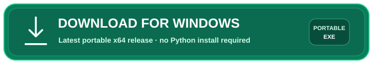
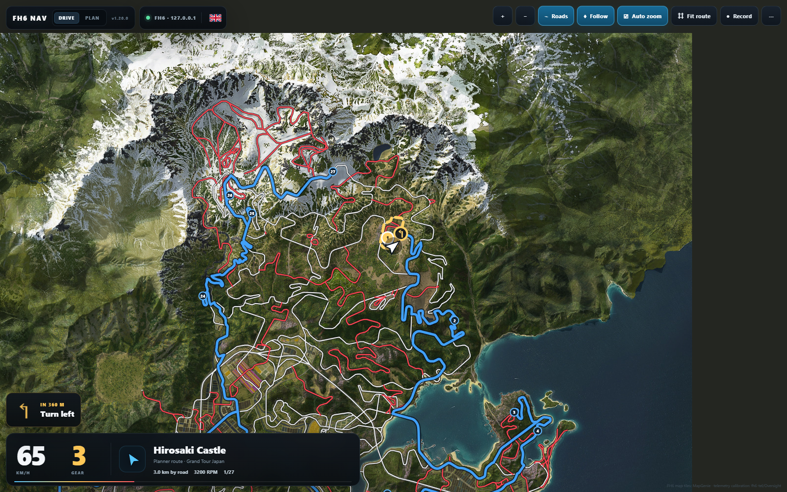
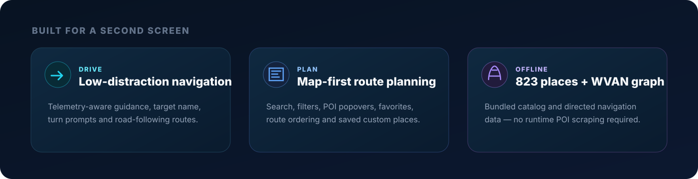
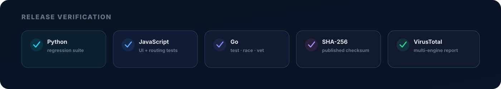

<div align="center">

<a href="https://dalink.to/bazaz">
  
</a>

<br />

[](https://github.com/atikhobaev/fh6-scenic-navigator/actions/workflows/ci.yml)
[](https://github.com/atikhobaev/fh6-scenic-navigator/actions/workflows/release-security.yml)
[](https://github.com/atikhobaev/fh6-scenic-navigator/releases/latest)


## 🧭 HUD-free navigation for Forza Horizon 6

**Live telemetry navigation + scenic route planning on a second monitor, tablet, phone, or another PC.**  
Keep the in-game HUD clean while your route, next turn, destination and map live somewhere else.

[🇷🇺 На русском](README_RU.md) · [📝 Changelog](CHANGELOG.md) · [🧠 Engineering story](docs/ENGINEERING_NOTES.md) · [🛡️ Security](SECURITY.md) · [☕ Buy me a coffee](https://dalink.to/bazaz)

<br />

<a href="https://github.com/atikhobaev/fh6-scenic-navigator/releases/latest/download/FH6_Scenic_Navigator_Windows_x64.exe">
  
</a>

**Windows 10/11 x64 · Portable · No installer · No separate Python setup**

<a href="https://dalink.to/bazaz">
  
</a>

<sub>Enjoy the cruise? Help keep this independent project rolling.</sub>

</div>

> [!NOTE]
> FH6 Scenic Navigator is a personal pet project and is not affiliated with Microsoft, Xbox, Playground Games, Turn 10 Studios, or the Forza brand.

## 🌄 Why I built it

I like driving around Forza Horizon with the HUD completely turned off. It makes cruising feel cleaner, more immersive and more relaxing.

The problem is that I am also used to setting a destination and following a route. With the HUD disabled, I kept opening the map or turning navigation back on — which defeated the whole point.

So I built a separate navigator for myself: **the game stays HUD-free, while navigation runs on a second monitor, tablet, phone, or another PC on the same network.**

What started as a small second-screen experiment eventually grew into a full route planner with live telemetry, scenic destinations, rerouting and directed road-aware navigation.

## 🖥️ FH6 Scenic Navigator in action


**PLAN** — explore the map, choose stops and build a road-aware route before you drive.



**DRIVE** — keep the route and next turn on a separate screen while the game stays HUD-free.
These are captures of the running v1.20.0 preview UI. DRIVE uses controlled test telemetry, not a live gameplay capture. Map imagery: MapGenie / respective game owners.

## ✨ What it does



- 🧭 **DRIVE mode** — low-distraction telemetry navigation with road-following routes, target names, turn prompts, distance guidance, auto zoom and rerouting behavior.
- 🗺️ **PLAN mode** — map-first route planning with search, grouped filters, POI popovers, favorites, custom places, route ordering, reverse/optimize tools and import/export.
- 🛣️ **Directed WVAN routing** — active guidance uses `fh6-navgraph-v1`, compiled from locally owned FH6 navigation data with directed road legality instead of guessing that every road works both ways.
- 📍 **823 catalog entries** — 796 game POI records plus 27 curated scenic destinations. **Preview limitation:** 772 game records use approximate road-network positions; only 24 retain source-exact coordinates. Use these layers for exploration, not precise collectible hunting.
- 🌍 **Localized UI** — English, Simplified Chinese, Russian and Latin American Spanish. Official game-name localization is used only where it can be proven; otherwise the app safely falls back to English.
- 📱 **Second-screen friendly** — open Navigator from a phone, tablet or another PC on the same LAN.
- 📦 **Portable Windows launcher** — one GUI EXE with the Navigator payload and official CPython 3.13.5 x64 embeddable runtime included.
- 📴 **Offline-first runtime** — bundled POIs, navigation graph and UI assets. Map imagery needs an initial internet connection and is cached locally; uncached areas are unavailable offline. No runtime POI scraping is required.

## ⚡ Quick start

1. **Download** the latest portable Windows EXE using the button above.
2. Run `FH6_Scenic_Navigator_Windows_x64.exe` and click **Start Navigator**.
3. In FH6 enable **Settings → HUD and Gameplay → Data Out** and set **Data Out = ON**, the launcher’s host IP, and port **1234**.
4. Open **DRIVE** while driving or **PLAN** to build a route first.

Want Navigator on another screen? Open the LAN address shown by the launcher from a phone, tablet or second PC on the same network.

➡️ See [How to run it](#-how-to-run-it) below for the full setup and troubleshooting guide.

## ⬇️ Download & verify

<!-- RELEASE_STATUS_START -->
### ✅ Latest release: `v1.20.0`

| Download | Integrity | Malware scan |
| --- | --- | --- |
| [**Windows x64 portable EXE**](https://github.com/atikhobaev/fh6-scenic-navigator/releases/latest/download/FH6_Scenic_Navigator_Windows_x64.exe) | [**SHA-256 file**](https://github.com/atikhobaev/fh6-scenic-navigator/releases/latest/download/FH6_Scenic_Navigator_Windows_x64.exe.sha256) | **VirusTotal:** ⏳ `VT_API_KEY` not configured — see [SECURITY.md](SECURITY.md) |

**SHA-256**

```text
0fc438f25ad998bb5f9f457e46457168ea59083e3148a2b755f7d2022b4e9278
```

[Open GitHub Release](https://github.com/atikhobaev/fh6-scenic-navigator/releases/tag/v1.20.0)
<!-- RELEASE_STATUS_END -->

> [!IMPORTANT]
> The release-security workflow publishes a stable download alias and `.sha256` file for every release. Once the repository secret `VT_API_KEY` is configured, every published EXE is also submitted to VirusTotal and the result is written back into this block automatically. VirusTotal is an external multi-engine signal, **not a guarantee that software is safe**.

### Verify manually on Windows

```powershell
Get-FileHash .\FH6_Scenic_Navigator_Windows_x64.exe -Algorithm SHA256
```

Compare the result with the adjacent `.sha256` asset in the same GitHub Release.

## 🚀 How to run it

### 1. Download and start the portable launcher

1. Download the latest **Windows x64 portable EXE** using the green button above.
2. Run `FH6_Scenic_Navigator_Windows_x64.exe` on Windows 10/11 x64.
3. No installation and no separate Python setup are required — the portable build already contains the Navigator payload and the official CPython embeddable runtime.
4. Click **Start Navigator** / **Запустить Navigator**.
5. Wait until the launcher reports that Navigator is running. The progress line shows preparation of the runtime, road graph, localization and local server.
6. Open **DRIVE** for live navigation or Open **PLAN** for route planning. If auto-open is enabled, DRIVE opens only after the local HTTP server is actually ready.

### 2. Enable FH6 telemetry

In FH6 open:

```text
Settings → HUD and Gameplay → Data Out
```

Set:

```text
DATA OUT = ON
IP       = the LAN IP shown by the Navigator launcher
PORT     = 1234
```

In other words, PORT = `1234`. Start driving after applying the settings. The launcher distinguishes between waiting for FH6, connected telemetry and a lost connection.

> [!TIP]
> If DRIVE is open on the same PC, the browser uses the local Navigator server. If you open it from a phone/tablet/second PC, both devices must be on the same LAN and Windows Firewall must allow the Navigator on a **Private** network.

### 3. DRIVE vs PLAN

- **DRIVE** — use while driving: current target, road-following route, distance, turn guidance, auto zoom, off-route detection and rerouting.
- **PLAN** — build routes before driving: search places, filter the map, open POI popovers, add stops, reorder route items, reverse/optimize and start navigation.

### 4. If the phone or another PC cannot connect

Run `allow_firewall.ps1` as Administrator or manually allow FH6 Scenic Navigator / its bundled Python runtime through Windows Firewall for **Private networks**.

The launcher shows both the local PC URL and the LAN URL to use on another device.

### 5. If startup fails

Expand **Startup Log / Журнал запуска** in the launcher. It opens automatically on startup errors.

Persistent logs are stored in:

```text
%LOCALAPPDATA%\FH6 Scenic Navigator\logs
```

The launcher also attempts conservative stale-process recovery if an old Navigator instance is still occupying the configured HTTP port.

For the longer Russian startup guide see [`HOW_TO_START.txt`](HOW_TO_START.txt).

## ☕ Support

If FH6 Scenic Navigator makes HUD-free cruising a little more enjoyable and you want to support future development, testing and releases:

### **[☕ Buy me a coffee](https://dalink.to/bazaz)**

The project remains a personal pet project; feedback and bug reports are just as useful as financial support.

## 🐛 Feedback & ideas

Found a routing bug, a missing place or something confusing in the UI? [Open an issue](https://github.com/atikhobaev/fh6-scenic-navigator/issues).

Ideas for better scenic driving, second-screen use and route planning are welcome too.

## 🧠 Engineering challenges we solved

This project stopped being a simple “draw a line between map points” experiment once real road legality entered the picture. The hardest part was making routes behave correctly on **complex interchanges, ramps and one-way roads**.

### 🛣️ Complex interchanges: nearby roads are not necessarily connected

At a motorway interchange, two ramps can cross almost at the same X/Z coordinates while being on different levels or having no legal connection at that point. A generic nearest-node graph can therefore create routes that look plausible from above but are impossible to drive.

The solution was to make **Directed WVAN** the routing authority. `fh6-navgraph-v1` is compiled from locally owned FH6 navigation data and preserves the game's structural connectivity instead of creating links merely because road geometry is close together.

### ↪️ One-way movement and turn legality

Early road graphs effectively behaved like:

```text
A <-> B
```

That is wrong for a one-way ramp. The final graph preserves directed movement such as:

```text
A -> B
```

The compiler keeps ordered WVAN sections, `oneway_forward`, exact shared `NavPoint` connections and explicit restrictions such as `no_right_turn` where available. This means the planner can prefer a longer but drivable interchange loop instead of routing backwards up an exit ramp.

### 🚫 Unknown rules fail closed

Some reverse-engineered fields — notably the exact numeric semantics around `uturn` — were not proven strongly enough to guess. Immediate reverse/U-turn transitions are therefore blocked, while a normal legal reversal through a loop/interchange is still possible through ordinary directed edges.

If no legal directed path exists, DRIVE/PLAN **fail closed** rather than falling back to a prettier but illegal bidirectional route.

### 📡 Picking the correct ramp from live telemetry

Routing legality alone is not enough: on parallel ramps the car can be physically close to several road segments. Runtime map matching therefore uses:

- X/Z distance to candidate segments;
- car yaw/bearing versus segment direction;
- continuity with the previously matched directed segment.

A persistent off-route state beyond roughly **45 m for 800 ms** triggers a new legal directed route to the same active destination.

### 🧩 Why ForzaLabs still matters

ForzaLabs/community data remains useful for visual road shape, overlays and contextual information. But it no longer decides whether a transition is legal. **ForzaLabs supplies useful geometry; Directed WVAN supplies traffic authority.**

Other problems solved along the way include official POI localization without machine-translation guessing, offline catalog packaging, a one-file portable launcher, stale-process recovery, Win32 UI responsiveness and killing orphaned Python servers reliably with a Windows Job Object.

➡️ **[Read the full engineering story →](docs/ENGINEERING_NOTES.md)**

## 🧪 Automated checks



Every push to `main` and every pull request runs separate checks so a failure is easy to identify:

| Check | What it validates |
| --- | --- |
| 🐍 **Python tests** | server, planner, routing, catalog, localization, launcher integration |
| 🟨 **JavaScript tests** | DRIVE/PLAN UI structure, routing logic, layers, popovers, i18n |
| 🐹 **Go tests** | native launcher behavior plus `go vet` and race detector |
| 🧹 **Repository hygiene** | no raw `.nav/.owt/.oww/.owbs` game assets and no committed `.exe` binaries |
| 🔐 **Release integrity** | stable asset alias + SHA-256 checksum attached to every release |
| 🛡️ **VirusTotal** | EXE submitted after publishing when `VT_API_KEY` is configured |

See [`SECURITY.md`](SECURITY.md) for the exact verification policy.

## 🧩 Architecture

```text
FH6 Data Out (UDP)
        │
        ▼
  Python server ───── Directed WVAN graph / POI catalog / SQLite
        │
        ├── /          → DRIVE
        ├── /planner/  → PLAN
        └── /api/*     → navigation / routes / places

Native Windows launcher (Go / Win32)
        │
        ├── embedded CPython runtime
        ├── embedded Navigator payload
        ├── process lifecycle / stale-process recovery
        └── logs / status / browser launch
```

### Routing authority

The active navigation path is produced from `fh6-navgraph-v1`, a directed graph compiled from locally owned FH6 WVAN navigation data. Raw game-owned `.nav`, `.owt`, `.oww` and `.owbs` files are intentionally excluded from source and releases.

## 🛠️ Run from source

Python 3.10+ is sufficient for the server/runtime code. Go is only required to build/test the native launcher. Node.js is used for JavaScript tests and Tailwind tooling.

```bash
python launcher.py
```

Run the full verification suites with:

```bash
python -m pip install pytest
python -m unittest discover -s tests -p 'test_*.py'
npm run test:js
go test ./...
go test -race ./...
go vet ./...
```

## 📁 Repository layout

```text
cmd/fh6-launcher/          native Windows launcher entrypoint
launcher_native/          launcher UI, extraction, process lifecycle, tests
fh6_nav/                  WVAN parsing / compiled graph tooling
static/                   DRIVE / PLAN frontend, i18n, data and assets
tools/                    build-time catalog/import tooling
tests/                    Python + JavaScript regression suites
scripts/                  build and release validation helpers
docs/                     design docs, artwork, engineering notes and release checklist
server.py                 local HTTP + telemetry server
launcher.py               source/development startup wrapper
```

## 📚 Documentation

- 🧠 [`docs/ENGINEERING_NOTES.md`](docs/ENGINEERING_NOTES.md) — how interchanges, one-way routing, map matching and launcher problems were solved
- 🇷🇺 [`README_RU.md`](README_RU.md) — extended Russian technical history
- 📝 [`CHANGELOG.md`](CHANGELOG.md) — reconstructed project version history
- 🚦 [`HOW_TO_START.txt`](HOW_TO_START.txt) — detailed Russian startup notes
- 🗺️ [`PLANNER_RU.md`](PLANNER_RU.md) — planner documentation
- 🧭 [`GAME_NAV_PROBE_RU.md`](GAME_NAV_PROBE_RU.md) — game navigation probing notes
- 🔬 [`NAV_BINARY_PROBE_RU.md`](NAV_BINARY_PROBE_RU.md) — binary navigation investigation
- 🛡️ [`SECURITY.md`](SECURITY.md) — release verification and VirusTotal policy
- ✅ [`docs/RELEASE_CHECKLIST.md`](docs/RELEASE_CHECKLIST.md) — repeatable release checklist
- 📜 [`THIRD_PARTY_NOTICES.md`](THIRD_PARTY_NOTICES.md) — third-party notices and data provenance

## 📜 Data & third-party sources

The project uses public factual map/location references and locally owned game data for interoperability and navigation research. Runtime catalogs retain provenance where applicable. No raw FH6 game navigation files are distributed in this repository or releases.

<div align="center">

---

**🌄 Drive calm · plan the scenic route · keep the HUD clean**

**[☕ Buy me a coffee](https://dalink.to/bazaz)**

</div>

## License

The original code is licensed under the [MIT License](LICENSE). Third-party code, game-derived data and map imagery retain their own terms; see [license scope](LICENSE_SCOPE.md), the [provenance review](docs/PROVENANCE_REVIEW.md) and [third-party notices](THIRD_PARTY_NOTICES.md).