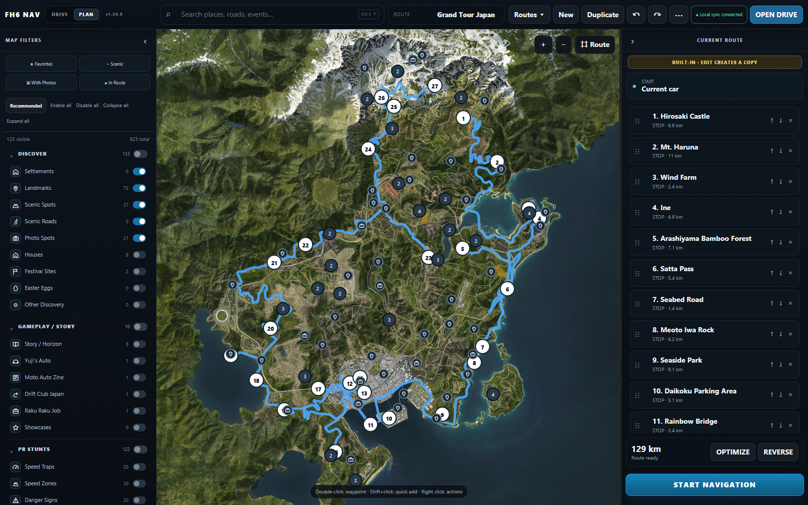

# 🧭 FH6 Scenic Navigator — навигация без HUD

**Живая телеметрия и планировщик живописных маршрутов для Forza Horizon 6.** Игра остаётся с чистым экраном, а карта, маршрут и следующий поворот — на втором мониторе, планшете или телефоне.

[⬇ Скачать portable Windows EXE](https://github.com/atikhobaev/fh6-scenic-navigator/releases/latest/download/FH6_Scenic_Navigator_Windows_x64.exe) · [English](README.md) · [Сообщить о проблеме](https://github.com/atikhobaev/fh6-scenic-navigator/issues) · [☕ Buy me a coffee](https://dalink.to/bazaz)

Windows 10/11 x64 · Один EXE · Без установки и отдельного Python.

## 🌄 Зачем я это сделал

Я люблю ездить в Forza с полностью выключенным HUD: так легче наслаждаться дорогой, пейзажами и самой поездкой. При этом привык задавать точку назначения и ехать по маршруту. Приходилось снова открывать карту или включать интерфейс.

Navigator позволяет оставить картинку игры чистой, а маршрут вынести на второй монитор, планшет или телефон. Небольшой личный эксперимент постепенно вырос в планировщик с живой телеметрией, живописными местами и навигацией по направленной дорожной сети.

## 🖥️ Navigator в действии



**PLAN** — поиск и фильтры, POI, избранное, свои точки, порядок остановок, оптимизация, импорт и экспорт маршрутов.

**DRIVE** — положение машины, следующий поворот, расстояние, маршрут по дорогам и перестроение при отклонении. [Посмотреть DRIVE](docs/images/screenshots/drive.png).

Снимки сделаны в запущенном preview-интерфейсе v1.20.0; DRIVE показан с тестовыми UDP-пакетами, а не с живым заездом. Изображения карты: MapGenie / правообладатели игры.

## ⚡ Быстрый старт / Quick Start

1. [Скачайте EXE](https://github.com/atikhobaev/fh6-scenic-navigator/releases/latest/download/FH6_Scenic_Navigator_Windows_x64.exe), запустите его и нажмите **Start Navigator / Запустить Navigator**.
2. В FH6 откройте **Settings → HUD and Gameplay → Data Out**.
3. Задайте **Data Out = ON**, **IP = адрес компьютера, показанный launcher**, **PORT = 1234**.
4. Откройте **DRIVE**, начните движение и проверьте появление телеметрии. В **PLAN** выберите маршрут или добавьте остановки и нажмите **START NAVIGATION**.
5. Для телефона или планшета откройте LAN-адрес launcher в браузере устройства в той же сети. В Windows Firewall разрешите Navigator и встроенный Python для **частной сети**.

На телефоне ничего устанавливать не нужно. Проверка хэша и актуальный статус сканирования — в [Download & verify](README.md#-download--verify).

## 📍 Что входит в preview

- **823 записи / 800+ POI:** 796 игровых записей и 27 живописных мест.
- **Ограничение точности:** у 772 игровых записей приблизительные позиции по дорожной сети; 24 сохраняют точные координаты источника. Это не точный справочник всех коллекционных предметов.
- Направленная дорожная маршрутизация учитывает одностороннее движение и ограничения переходов.
- Portable Windows build содержит Python runtime. Второй экран работает через браузер по LAN.
- Интерфейс и каталог доступны локально; изображения карты загружаются и кэшируются. Для ещё не посещённых областей нужен интернет.

## 💬 Обратная связь и поддержка

Баги и пожелания: [GitHub Issues](https://github.com/atikhobaev/fh6-scenic-navigator/issues). Укажите версию, шаги воспроизведения и ожидаемое поведение; перед приложением логов удалите личные адреса и пути.

Если Navigator делает поездки приятнее: **[☕ Buy me a coffee](https://dalink.to/bazaz)**. Обратная связь тоже помогает развитию проекта.

Оригинальный код распространяется по [лицензии MIT](LICENSE). У стороннего кода, игровых данных и изображений карты отдельные условия: [границы лицензии](LICENSE_SCOPE.md) и [анализ происхождения кода и данных](docs/PROVENANCE_REVIEW.md).

## 📚 История разработки / Technical history

Ниже сохранена прежняя техническая документация. Исторические описания относятся к указанным версиям.

# FH6 Scenic Navigator v1.19.2 — PORTABLE LAUNCHER

## v1.19.2 — один EXE вместо BAT

Обычный запуск теперь рассчитан на **`FH6 Scenic Navigator.exe`**. Это небольшое нативное Windows-окно в стиле Horizon Command: без консоли и без установки. До запуска оно показывает одну главную кнопку **Запустить Navigator**; во время старта — понятные этапы; после готовности — **Открыть DRIVE**, **Открыть PLAN** и вторичную команду остановки.

Launcher показывает только полезные статусы: обнаружение FH6/StringTables, покрытие официальной локализации POI, готовность Directed WVAN/каталога, локальный/LAN адрес и подключение телеметрии. Технический журнал по умолчанию свернут, автоматически раскрывается при ошибке и сохраняется в `%LOCALAPPDATA%\FH6 Scenic Navigator\logs`.

В Settings оставлены только рабочие предпочтения: автоматическое открытие DRIVE, сворачивание после открытия браузера, порты и общий язык интерфейса. Повторный запуск EXE не создаёт второй сервер — поднимается уже существующее окно. Начиная с v1.19.2 закрытие окна останавливает Navigator и завершает launcher; сиротский сервер на порту 8080 оставаться не должен.

DRIVE и PLAN по-прежнему открываются в обычном браузере. Внутри desktop-окна браузер/WebView не используется.

### Portable runtime

Финальная one-file сборка может включать официальный CPython 3.13.5 embeddable runtime. Build pipeline принимает только архив с заранее зафиксированным SHA-256. Если runtime не встроен, launcher сначала использует совместимый установленный Python, а при его отсутствии может безопасно скачать точный официальный runtime с python.org и проверить хэш перед использованием.

---

## v1.18.2 — UI polish + диагностика локализации

- Удалены бессодержательные auto-tooltips вида «Действие: X. Нажмите, чтобы выполнить функцию». Tooltip показывается только когда для кнопки есть отдельное осмысленное описание; иначе подсказки нет.
- Emoji-флаги заменены на встроенные SVG для English / 简体中文 / Русский / Español (Latinoamérica), поэтому выбор языка не зависит от поддержки flag emoji в Windows/браузере.
- Переключатель языка находится в левом status-блоке DRIVE рядом со статусом подключения. Выбранный язык сохраняется и автоматически применяется также в PLAN.
- Автопоиск FH6 StringTables теперь понимает дополнительные Steam Library из `steamapps/libraryfolders.vdf` и стандартный Xbox App layout `X:\XboxGames\Forza Horizon 6\Content`. Остаются ручные overrides `FH6_STRINGTABLES_DIR` и `FH6_PATH`.
- Launcher печатает реальное покрытие официальной локализации по языкам, например `EN 612/796 | ZH 590/796 | RU 604/796 | ES-LATAM 601/796`. Этот же статус виден в меню языка.
- Счётчик покрытия относится только к 796 игровым POI; 27 curated-точек в него не подмешиваются.
- Если конкретную точку нельзя однозначно связать со строкой FH6, она остаётся на английском. Машинный перевод и догадки не используются.

**Почему часть POI всё равно может быть на английском:** текущий каталог содержит как настоящие названия (`1962 Lincoln Continental`), так и технически нормализованные записи вроде `Landmark #015` / `Cross-Country Event #003`. StringTables можно применить только когда английское имя однозначно совпадает с официальной строкой игры. Для generic-записей в каталоге пока нет доказанного StringTable key/hash, поэтому безопасный fallback — английский.


## v1.17.2 — что изменилось

- Встроено **796 game POI** из полного постоянного inventory (38 source-категорий) + 27 curated scenic places.
- `start.bat` и обычный `update_map_data.bat` остаются офлайн: никакого обязательного скачивания каталога при запуске.
- 24 Barn Find/Treasure Car сохраняют опубликованные точные координаты; остальные массовые записи в этой pet-project сборке размещены детерминированно по встроенной дорожной геометрии ForzaLabs, чтобы все слои были доступны и маршрутизируемы сразу.
- Контекстное меню карты закрывается кликом вне меню и при новом правом клике.
- Короткий клик по POI снова открывает popover; drag от маркера продолжает двигать карту после порога 5 px.
- Долгие локальные операции показывают этапы `[1/5] ... [5/5]`.

Локальная навигация для **Forza Horizon 6** под съёмку без игрового HUD. Forza остаётся чистой для OBS, а телефон/планшет/второй монитор показывает карту, машину, скорость, передачу, RPM, directed-маршрут и turn-by-turn.

## v1.17.1 — OFFLINE DATA + PROGRESS

- Удалён сетевой bootstrap из `launcher.py`: обычный `start.bat` **не скачивает POI, screenshots или road dataset** и не ждёт сторонние сайты перед запуском.
- В релиз теперь встроены используемые runtime-данные: `builtin_places.json`, `scenic_catalog.json`, `fh6_roads.json` (457 дорог / 6900 route nodes) и compiled `fh6_navgraph_v1.json.gz`.
- `update_map_data.bat` больше ничего не загружает из интернета. Он только заново строит каталоги из локальных snapshot-файлов и привязывает точки к bundled Directed WVAN.
- Для запуска и пересборки добавлены явные этапы прогресса `[1/5] ... [5/5]` с `flush`, поэтому CMD показывает, на какой операции находится программа.
- Публикация пересобранных каталогов выполняется через временные файлы и `os.replace`: незавершённая сборка не должна подменять рабочие JSON.
- Runtime road provider по умолчанию работает только с `static/data/fh6_roads.json`. Если файл отсутствует/повреждён, сервер выдаёт понятную ошибку вместо скрытой попытки скачать его.
- Bundled game snapshot сейчас содержит **24 проверенные точки** (Barn Finds / Treasure Cars), а curated-каталог — **27 scenic destinations**. В source inventory сохранена справочная оценка до 796 публичных маркеров, но Navigator не притворяется, что неподтверждённые координаты уже встроены.
- Координаты не угадываются по screenshot, названию или картинке карты: в runtime попадают только локально сохранённые, проверяемые координатные records.
- Исправления v1.17 для drag/click arbitration маркеров, локальных media-paths, map-first Planner и Directed WVAN сохранены.

**Важно:** POI, road dataset и Directed-WVAN graph теперь локальные. Фоновые raster tiles самой карты по-прежнему загружаются существующим tile-proxy при просмотре и кэшируются отдельно; это не участвует в startup/rebuild каталога.


## v1.16.3 — SVG ICONS + LOW-ZOOM MAP + QUIET CMD

- Маркеры Planner больше не используют символы шрифта Windows: категории рисуются собственными SVG-пиктограммами из `static/planner/icons.js`.
- Те же SVG-пиктограммы используются в маркерах карты, списке слоёв и глобальном поиске.
- Выбранный POI сохраняет обычный маркер и свою пиктограмму; поверх него добавляется отдельное жёлтое кольцо выбора.
- DRIVE и PLAN при масштабе z9/z10 используют реальные z11 MapGenie tiles и уменьшают их в браузере; запросы `/maptile/9/...` и `/maptile/10/...` больше не нужны.
- Tile requests ограничены фактическим FH6 map extent, поэтому при полном отдалении не запрашиваются заведомо внешние тайлы.
- Сервер подавляет нормальные браузерные `WinError 10053/10054` / `BrokenPipeError`, возникающие при отмене уже ненужных HTTP-запросов.
- `/favicon.ico` возвращает пустой успешный ответ вместо `404`, чтобы не засорять CMD.
- Низкоуровневый tile endpoint принимает только z11–z14 и не отправляет случайные z9/z10-запросы upstream.

## v1.16.2 — STARTUP + UI FIX

- Переключатель `DRIVE | PLAN` теперь есть и на экране DRIVE, и в Planner; активный режим выделен одинаково.
- Старая отдельная кнопка `PLAN ROUTE` на DRIVE удалена как дублирующая переключатель.
- Исправлено сохранение состояния свёрнутых групп фильтров: можно одновременно свернуть любое количество категорий.
- Добавлены `Collapse all` и `Expand all` для мгновенного сворачивания/раскрытия всех групп фильтров.
- `start.bat` больше не открывает браузер заранее: launcher сначала закрывает предыдущую копию FH6 Navigator на порту 8080, затем запускает новую сборку.
- HTML/JS/CSS отдаются с `Cache-Control: no-store`, а DRIVE и PLAN показывают номер текущей сборки.

## v1.16 — MAP-FIRST PLANNER

В v1.16 режим **PLAN** переделан вокруг карты. Карта занимает основную часть окна, слева находится компактная панель **MAP FILTERS**, справа — **CURRENT ROUTE**. Постоянного длинного каталога карточек и отдельной страницы Details больше нет.

Главные изменения:

- глобальный поиск в верхней панели ищет по полному каталогу, даже если соответствующий слой скрыт;
- все категории POI сохранены в сгруппированных слоях: Discover, Gameplay/Story, PR Stunts, Events, Races, Collect/Cars, Community и My;
- пресет **Recommended** по умолчанию показывает спокойный набор: Settlements, Landmarks, Scenic Spots/Roads, Photo Spots и My Places;
- доступны **Enable all / Disable all / Recommended**, состояние слоёв сохраняется локально;
- route markers, выбранная точка и временно раскрытый search-result никогда не исчезают из-за фильтра/кластеризации;
- клик по POI открывает **popover прямо на карте** с действиями Add to route / Set destination / Favorite;
- картинки в popover разрешены только как локальные `/media/places/...` файлы — runtime не зависит от ForzaHorizon.app;
- **Grand Tour Japan** теперь отображается в Saved Routes как встроенный read-only маршрут из 27 точек;
- встроенный Grand Tour можно запустить напрямую через Directed WVAN, не создавая пользовательскую копию;
- первая структурная правка встроенного маршрута атомарно создаёт **Grand Tour Japan — Copy** и продолжает редактирование уже копии;
- SQLite schema v2 позволяет Navigation Session ссылаться на виртуальный built-in route; при миграции v1→v2 сначала создаётся backup;
- добавлен offline community pipeline: `community_evidence.json` хранит source evidence, а `community_places.json` получает только точки с доказанными FH6 world coordinates и валидным WVAN anchor;
- сомнительные/неполные community координаты никогда не угадываются по screenshot или картинке карты;
- authoritative **Directed WVAN** остаётся единственным active router; fallback на legacy bidirectional `shortestPath()` не добавлен.

### Быстрый запуск

1. Запусти `start.bat`.
2. В DRIVE нажми **PLAN** в переключателе `DRIVE | PLAN` или открой `/planner/`.
3. Используй глобальный Search и MAP FILTERS, кликай по маркерам и добавляй нужные точки из popover.
4. Для готового базового тура открой **Saved Routes → Built-in → Grand Tour Japan**.
5. Когда preview legal/resolved, нажми **START NAVIGATION**.

Подробная инструкция: **`PLANNER_RU.md`**.

## Что изменилось в v1.9

Главное изменение — порядок достопримечательностей больше не считается безусловно правильным только потому, что он записан в `route.json`.

После загрузки дорожного графа навигатор:

1. привязывает POI к дорожным узлам;
2. строит предварительную замкнутую петлю;
3. смотрит, в каком порядке дорога **фактически впервые проходит через дорожные узлы будущих POI**;
4. переставляет такие точки вперёд;
5. повторяет уточнение порядка и только после этого строит основной синий маршрут.

Пример: если исходно записано `A → B → C`, но дорога из A к B уже проходит через C, порядок автоматически становится `A → C → B`. Это убирает ситуацию «уже проехал достопримечательность, а через несколько пунктов навигатор заставляет возвращаться к ней».

Hirosaki Castle всегда остаётся началом и концом замкнутой петли. При переключении `↻ / ↺` уточнённый порядок разворачивается в обратную сторону.

## Правая / восточная часть карты

Маршрут специально расширен в ранее почти не задействованную правую часть карты. Добавлены:

- **Mt. Haruna**
- **Wind Farm**
- **Ine**
- **Arashiyama Bamboo Forest**
- **Satta Pass**
- **Seabed Road**
- **Meoto Iwa Rock**
- **Seaside Park**

Эти POI образуют длинную восточную ветку от Hirosaki к побережью и Tokyo. Для мест, где landmark-пин может затянуть машину в парковку/тупик, используется `throughAsphalt`: навигационная цель переносится на ближайший проходной асфальтовый узел.

## Новый базовый круг

**Hirosaki Castle → Mt. Haruna → Wind Farm → Ine → Arashiyama Bamboo Forest → Satta Pass → Seabed Road → Meoto Iwa Rock → Seaside Park → Daikoku Parking Area → Rainbow Bridge → Tokyo Tower → Meiji Jingu Gaien Ginkgo Avenue → Shibuya Crossing → Hakone Nanamagari → Kawazu Nanadaru Loop Bridge → Izu Skyline → Peace Torii → Fuji Shibazakura → Bandai Azuma Skyline → Narai-Juku → Yoshinoyama → Shirakawa-go → Temple of Nachi Falls → Norikura Skyline → Sotoyama Ski Resort → Tateyama Kurobe Alpine Route → Hirosaki Castle.**

Это **seed-порядок**. Реальный список в меню после загрузки дорожного графа может немного измениться, если оптимизатор обнаружит, что конкретную POI маршрут уже естественно пересекает раньше.

## Асфальт и повтор дорог

- Белые линии — асфальт.
- Красные — `dirt` / `dirtSnow`.
- Синяя — весь рассчитанный scenic-маршрут.
- Жёлтый пунктир — текущий остаток пути до следующей POI.
- Асфальт имеет строгий приоритет; грунт используется только если асфальтового соединения нет.
- Уже использованные дорожные рёбра получают высокий штраф (`reusePenalty = 7`).
- Немедленный возврат по только что пройденному ребру запрещается, если существует другой путь.

## Навигация

- Жёлтый пунктир постоянно показывает оставшийся маршрут до следующей POI и укорачивается по мере движения.
- При достижении POI автоматически переключается на следующий участок.
- В меню `☰` можно нажать любую POI и сделать её следующей целью.
- Можно ехать `↻` или `↺`; весь дорожный маршрут и turn-by-turn пересчитываются.
- Карточка следующего манёвра пульсирует: **500 м** — мягко, **300 м** — заметнее, **100 м** — срочно.
- При `◎ Следить` автозум: ниже **40 км/ч** → `zoom 15`, выше **45 км/ч** → возврат к прежнему масштабу.

## Запуск

1. Распакуй папку.
2. Запусти `start.bat`.
3. На телефоне в той же Wi-Fi/LAN сети открой адрес `PHONE`, который появится в консоли.
4. В FH6: **Settings → HUD and Gameplay → Data Out**:
   - `DATA OUT = ON`
   - `DATA OUT IP =` IP из строки `FORZA Data Out IP`
   - `DATA OUT PORT = 1234`

Python 3.10+ нужен только на ПК. `pip install`, Node.js, Docker и SimHub для обычного запуска не нужны.

Authoritative `fh6-navgraph-v1` уже встроен в сборку и работает offline. Бело-красный вспомогательный road-overlay и тайлы карты могут кэшироваться локально.

## Источники / interoperability

Формат FH6 Data Out и калибровка карты сверены с открытыми FH6 telemetry-проектами. Дорожная сеть и базовый принцип Dijkstra — ForzaLabs / MIT-проект ForzaDrive. Координаты landmarks — Forza Horizon Hub / MapGenie. Подробности находятся в `THIRD_PARTY_NOTICES.md`.

---

## Диагностика направления дорог — v1.12

Для исследования настоящих FH6 navigation-assets добавлен отдельный read-only инструмент:

```text
probe_game_nav_assets.bat
```

Он не нужен для обычной работы навигатора. Используй его только для подготовки `FH6_Game_Nav_Probe_Report.zip`, который затем можно прислать для разработки Directed Routing. Подробная инструкция: `GAME_NAV_PROBE_RU.md`.

## v1.13: бинарный probe внутренних NAV-файлов

Для следующего этапа Directed Routing добавлен `probe_nav_binary_samples.bat`. Он выбирает `Brio_00.nav` и четыре `Route*.nav` разных размеров, анализирует бинарный формат и создаёт `nav_probe_output/FH6_NAV_Binary_Probe.zip`. Подробности: `NAV_BINARY_PROBE_RU.md`.


---

## v1.14 — Directed WVAN Routing

Active navigation теперь использует **внутренний WVAN navigation graph FH6**, а не двунаправленный граф LabsGG.

Что изменилось:

- встроен скомпилированный `fh6-navgraph-v1` из пользовательского `Brio_00.nav`;
- источник graph проверяется SHA-256: `f06b4b958e60af5e52bc456173a5ba2b3ce6c900c732c8c5d96bd426498f5dbb`;
- 38 473 NavPoints и 71 222 directed road segments;
- `oneway_forward` не получает обратного ребра, поэтому навигатор не может построить маршрут задом по одностороннему съезду;
- junction соединяются только через одинаковый NavPoint ID — визуально пересекающиеся дороги разных уровней не склеиваются;
- `no_right_turn` исключается из transition graph;
- мгновенный reverse/U-turn по тому же ребру запрещён, пока числовые WVAN `uturn`-коды не будут доказаны отдельно;
- map matching использует X/Z машины, yaw и continuity предыдущего directed segment;
- после ухода более чем на 45 м от guidance в течение 800 мс текущий yellow leg автоматически перестраивается к той же POI;
- если legal directed path отсутствует, навигация работает **fail-closed** и показывает `МАРШРУТ НЕ НАЙДЕН ПО РАЗРЕШЁННЫМ НАПРАВЛЕНИЯМ`;
- бело-красный LabsGG road overlay, autozoom 40/45, предупреждения 500/300/100 м, tooltips, выбор следующей POI и обратное направление тура сохранены.

В burger menu строка `Routing: Directed / WVAN · route validated` подтверждает, что authoritative directed graph загружен. Если WVAN graph недоступен, старый bidirectional router **не используется как fallback** для active guidance.